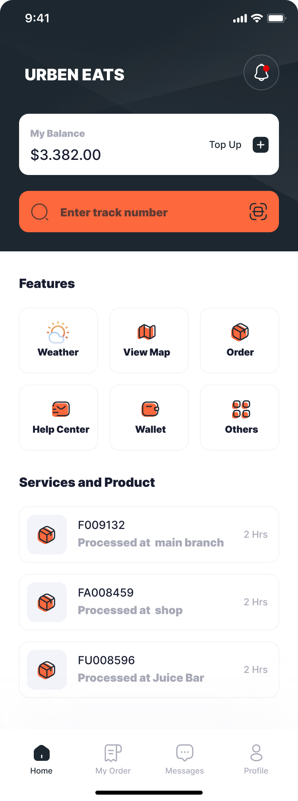

# UrbenEatsApp for riders - UI Designs

## Description

Urben Eats is an innovative mobile application designed to enhance the user experience for delivery riders. It allows riders to seamlessly integrate additional features and functionalities into their delivery experience, managing deliveries and track earnings easier than ever.

## Features

- **Real-Time GPS Navigation and Traffic Updates**: Ensures that all riders can find the fastest and safest routes to their destinations.
- **In-App Messaging and Support**: Provides immediate assistance from customer service through a built-in chat feature, addressing issues on-the-go.
- **Delivery Management**: Track deliveries in real-time with advanced tracking options.
- **Notifications**: Receive timely updates and notifications about orders and promotions.
- **Flexible Scheduling**: Allows riders to pick and choose their hours, adapting to the varied availability of part-time and full-time riders.

## Installation

To get Add My Urben Eats UI designs, follow these steps:

1. Star the repository: `https://github.com/yourusername/add-my-urben-eats.git`
2. Navigate into the figma link: `https://www.figma.com/design/9fWzca8W9hanx7wOFfcGPi/Urben-Eats-Mobile-App?node-id=1-27&t=T2hBUS32n5l70Sce-1`
3. If not you can access through figma file I've uploaded.

## Contributing

Contributions are welcome! Feel free to open an issue or submit a pull request.

## License

This project is licensed under the MIT License - see the [LICENSE](LICENSE) file for details.
